# Cyber Security [PEC-CS702E] Previous Year Questions

You will notice MAKAUT asking questions that differs from their syllabus but **don't panic.** Answer the best you can.

💡 **Tip:** Try to understand what these answers convey. The key — *remember the skeleton, then decorate in exam hall* 💯

## 2023 - 2024

### 23.1. 🟢 Group A (Very Short Answer Type) [1×10=10]

---

#### *i. What is the existence of weakness in a system or network known as?*

**Answer:** Vulnerability

*Explanation:* A vulnerability is a flaw or weakness that can be exploited by a threat actor.

---

#### *ii. Which DDoS in mobile systems waits for the owner to trigger the cyber attack?*

**Answer:** Botnets (or Mobile Botnets)

*Explanation:* Some mobile malware enrolls devices into a botnet. The device remains dormant until activated (via command from the attacker) to participate in a DDoS attack, often without the owner's knowledge.

---

#### *iii. Why are factors like Confidentiality, Integrity, Availability, and Authenticity considered as the fundamentals?*

**Answer:** They form the core principles (CIA Triad + Authenticity) of information security.

*Explanation:* These are the foundational goals of cybersecurity. Everything else—policies, tools, controls—is built to achieve these.

---

#### *iv. What refers to exploring the appropriate, ethical behaviors related to the online environment and digital media platform?*

**Answer:** Cyber Ethics

*Explanation:* Cyber ethics deals with the moral principles and rules that guide behavior in the digital world.

---

#### *v. What type of text is transformed with the help of a cipher algorithm?*

**Answer:** Plaintext

*Explanation:* A cipher algorithm encrypts readable plaintext into unreadable ciphertext.

---

#### *vi. "Cyberspace" was coined by ____.*

**Answer:** William Gibson

*Explanation:* The term was popularized by author William Gibson in his 1984 novel *Neuromancer*.

---

#### *vii. Network failure is primarily a ____ issue.*

**Answer:** Availability

*Explanation:* Availability ensures that systems and data are accessible when needed. A network failure directly impacts this.

---

#### *viii. ____ means the security of data from tampering by unidentified users.*

**Answer:** Integrity

*Explanation:* Integrity ensures that data is accurate, trustworthy, and protected from unauthorized modification.

---

#### *ix. Which is a sort of independent type of malicious program that would not require any host program?*

**Answer:** Worm

*Explanation:* Unlike viruses, worms are standalone malware that self-replicate and spread without needing to attach to a host file.

---

#### *x. An act to injure, corrupt, or threaten a system or network is characterized ____.*

**Answer:** Cyber Attack

*Explanation:* Any malicious act aimed at harming systems, networks, or data is termed a cyber attack.

---

#### *xi. What is security misconfiguration?*

**Answer:** Improper configuration of security settings like insecure/default settings, unnecessary services, or incorrect permissions that leaves systems vulnerable.

*Examples:* Default passwords, leaving unused ports open, verbose error messages, unsecured cloud buckets, or failing to apply patches.

---

#### *xii. Differentiate worm and virus.*

- **Virus:** Requires a host program to spread; not independent.  
- **Worm:** Is standalone and can spread independently across networks without user action.  

---

## 23. 🟡 Group B (Short Answer Type Questions)

---

### Q2. Define Security risk and analysis

---

- **Security Risk** → possibility of loss/damage to data, applications, or systems due to threats exploiting vulnerabilities.
- **Risk Analysis** → process of identifying assets, vulnerabilities, threats, and evaluating their impact & likelihood to determine risk level.

---

### Q3. Explain Data backup security, Data archival security, and Data disposal considerations

---

- **Data Backup Security:** Protecting backup copies from loss, theft, or tampering (e.g., encryption, off-site storage).
- **Data Archival Security:** Securing long-term stored data (archives) to maintain integrity, confidentiality, and accessibility.
- **Data Disposal Considerations:** Ensuring deleted data cannot be recovered — use data wiping, degaussing, or physical destruction.

---

### Q4. What is the use of policy?

---

Security **policy** defines rules, guidelines, and best practices for protecting organizational IT assets.

- Provides a framework for acceptable use, risk management, compliance, and incident response.

---

### Q5. Define session hijacking and its various challenges

---

- **Session Hijacking:** Unauthorized access to a user session (e.g., stealing cookies, session IDs) to impersonate the user.
- **Challenges:**

  1. Detecting stolen sessions in real time.
  2. Securing session tokens from sniffing/replay.
  3. Handling encrypted but hijacked sessions.

---

### Q6. Explain the Feistel cipher in detail

---

- **Feistel Cipher:** A structure used to design symmetric block ciphers (e.g., DES).
- **Process:**

  1. Plaintext is split into Left (L) and Right (R) halves.
  2. Multiple rounds of substitution & permutation.
  3. In each round: `Li = Ri-1`, `Ri = Li-1 ⊕ F(Ri-1, Ki)` (where F = round function, Ki = round key).
  4. After rounds, halves are combined → ciphertext.
- **Importance:** Allows same structure for both encryption & decryption (just reverse round keys).

---

## 23. 🔴 Group C (Long Answer Type Questions)

---

### Q7. Write short notes on: a. Firewall b. Backdoor c. Trapdoor

---

- **Firewall:** Security system (hardware/software) that monitors & controls network traffic using rules; protects against unauthorized access.
- **Backdoor:** Hidden entry point in a system/application bypassing normal authentication; often exploited by attackers.
- **Trapdoor:** A secret mechanism intentionally built into software/algorithm allowing special access, usually unknown to users.

---

### Q8. a. Discuss the SQL Injection in detail

---

- **SQL Injection:** Web attack where malicious SQL code is inserted into queries to access or manipulate databases.
- **Example:** `SELECT * FROM users WHERE username=' ' OR '1'='1' --'`
- **Impact:** Unauthorized login, data theft, database corruption.
- **Prevention:** Input validation, parameterized queries, stored procedures, least privilege.

**b. What is buffer overflow?**
**Ans:** Writing more data into a buffer than its capacity → overwrites adjacent memory → can cause crashes or allow malicious code execution.

**c. How to minimize Buffer Overflow?**

- Use secure coding (`strncpy` instead of `strcpy`).
- Enable compiler protections (Stack canaries, DEP, ASLR).
- Validate all user inputs.

---

### Q9. a. How VoIP hacking is done by hackers?

---

Hackers exploit VoIP by:

- Eavesdropping (packet sniffing).
- Caller ID spoofing.
- Denial of Service (DoS) on VoIP servers.
- Toll fraud (making calls via compromised accounts).

**b. What are the measures for it?**

- Encrypt VoIP traffic (SRTP, TLS).
- Strong authentication.
- Firewalls & Intrusion Detection Systems.
- Regular monitoring & patching VoIP servers.

**c. Identify wireless network defense.**

- Use strong encryption (WPA3).
- Disable WPS.
- MAC filtering & hidden SSID.
- IDS/IPS for wireless monitoring.

---

### Q10. a. Name and explain the two protocols to use for E-mail Security

---

1. **PGP (Pretty Good Privacy):** Uses RSA/DSS (asymmetric) + AES/DES (symmetric) for encrypting emails & digital signatures.
2. **S/MIME (Secure/Multipurpose Internet Mail Extensions):** Provides encryption + signing using public key certificates.

**b. Explain Cryptanalysis process.**

Process of breaking ciphers without knowing the key by analyzing ciphertext.  Methods:

- Brute force attack.
- Frequency analysis.
- Differential/linear cryptanalysis (for modern block ciphers).

**c. What is transposition cipher?**

Classical cipher that scrambles the order of characters without changing them. Example: Rail Fence Cipher.

---

### Q11. a. Elaborate "Cyber-crime plays a vital role against person, property, and govt. to protect all valuable Information and rights."

---

- **Against Person:** Identity theft, phishing, harassment.
- **Against Property:** Hacking, data theft, malware damaging assets.
- **Against Govt.:** Cyber terrorism, espionage, attacks on defense/critical infra.
  👉 Hence, laws & measures are vital to protect information & rights.

**b. Encrypt a plain text using transposition cipher key.**

- Example plaintext: `ATTACK`. Key: 3.
- Arrange in 3 columns:

  ```text
  A T T
  A C K
  ```

- Read column-wise: **AA T C T K** = Ciphertext.

**c. What is transposition cipher?**

Cipher where letters are **rearranged** (not substituted). Security comes from the rearrangement pattern (key).

---

## 2022 - 2023

### 22.1. 🟢 Group A (Very Short Answer Type) [1×10=10]

---

**i. "Cyberspace" was coined by _______.**

- **Answer: William Gibson**
- *Explanation:* The term was popularized by science fiction author William Gibson in his 1982 story "Burning Chrome" and later in his seminal 1984 novel *Neuromancer*.

---

**ii. Which is the oldest techniques used by hackers for phone hacking to make free calls?**

- **Answer: Phreaking** (or **Phone Phreaking**)
- *Explanation:* Phreaking involved manipulating the tone-based signaling system (e.g., using a "blue box" to generate a 2600 Hz tone) used by telephone companies to make free long-distance calls. It is the precursor to modern computer hacking.

---

**iii. An attempt to steal, spy, damage or destroy computer systems, networks, or their associated information is known as _______.**

- **Answer: Cyber Attack**
- *Explanation:* This is the standard definition of a cyber attack, which is any malicious act aimed at compromising digital systems and data.

---

**iv. The Code Red is sort of a _______.** (Assuming the question is incomplete, e.g., "...sort of a worm")

- **Answer: Computer Worm**
- *Explanation:* The Code Red worm was a major security incident in 2001 that targeted computers running Microsoft's IIS web server. It was a self-replicating malware that spread without user intervention, fitting the definition of a worm.

---

**v. Give an example of physical hacking.**

- **Answer: Installing a hardware keylogger on a computer** (or **Tailgating into a secure building**, **Dumpster Diving**)
- *Explanation:* Physical hacking bypasses digital security by targeting the physical infrastructure. Installing a device to capture keystrokes is a direct physical tampering attack.

---

**vi. What is the existence of weakness in a system or network is known as?**

- **Answer: Vulnerability**
- *Explanation:* A vulnerability is a flaw or weakness in a system's design, implementation, or operation that could be exploited to violate the system's security policy.

---

**vii. Which independent type of malicious program does not require any host program?**

- **Answer: Worm**
- *Explanation:* Unlike viruses, which need to attach themselves to a host file or program, worms are standalone malicious software that can self-replicate and spread independently across networks.

---

**viii. What are Trojan-Horse programs?**

- **Answer: Malicious programs that disguise themselves as legitimate or useful software.**
- *Explanation:* Named after the Greek myth, a Trojan horse appears to be benign (e.g., a game or a utility) but, when executed, performs malicious actions such as stealing data or creating a backdoor on the system.

---

**ix. When there is an excessive amount of data flow, which system cannot handle, ______ attack takes place.**

- **Answer: Denial-of-Service (DoS)** or **Flood**
- *Explanation:* A Denial-of-Service attack aims to make a machine or network resource unavailable to its intended users by overwhelming it with a flood of illegitimate traffic or data requests.

---

**x. A _____ can be a hardware device or a software program that filters all the packets of data that comes through a network, the internet, etc.**

- **Answer: Firewall**
- *Explanation:* A firewall is a network security device or software that monitors and filters incoming and outgoing network traffic based on an organization's previously established security policies.

---

**xi. The Hacker who did break the SIPRNET system is _____.**

- **Answer: Gary McKinnon** (or **"Solo"**), Kevin Poulsen
- *Explanation:* Gary McKinnon, a Scottish hacker, was accused in 2002 of perpetrating the "biggest military computer hack of all time" by breaking into NASA and U.S. military (including SIPRNET) systems. He often used the handle "Solo".

---

**xii. A cyber-criminal or penetration tester uses the additional data that stores certain special instructions in the memory for activities to break the system. Name the type of attack.**

- **Answer: Buffer Overflow Attack**
- *Explanation:* This describes a classic buffer overflow attack. The attacker sends more data (the "additional data") to a buffer than it can hold. The excess data overflows into adjacent memory and can overwrite it with malicious instructions ("special instructions") that the system then executes.

---

### 22. 🟡 Group-B (5 × 3 = 15)

---

### Q2. Discuss Security Architecture

- **Definition**: Framework that defines security policies, processes, and technologies to protect information.
- **Key Components**:

  1. **Confidentiality** – data hidden from unauthorized users.
  2. **Integrity** – accuracy and trustworthiness of data.
  3. **Availability** – resources accessible when needed.
  4. **Authentication & Authorization** – identity verification and permission control.
  5. **Accountability** – logging and monitoring user activities.
- **Goal**: Provide a structured way to defend against threats and manage risks.

---

### Q3. Difference between Symmetric and Asymmetric Encryption

| **Feature**        | **Symmetric**              | **Asymmetric**                   |
| ------------------ | -------------------------- | -------------------------------- |
| Keys used          | Single key (shared secret) | Public key + Private key pair    |
| Speed              | Fast (less computation)    | Slow (more computation)          |
| Security           | If key leaked → insecure   | More secure, harder to break     |
| Example Algorithms | AES, DES, RC4              | RSA, DSA, ECC                    |
| Usage              | Encrypting large data      | Key exchange, digital signatures |

---

### Q4. Steps to Analyze E-Mail Application’s Security Vulnerabilities

1. **Check Authentication** – weak/absent authentication methods.
2. **Examine Protocols** – SSL/TLS enabled or not.
3. **Analyze Headers** – look for spoofing, forged addresses.
4. **Check Attachments** – malware spread via attachments.
5. **Inspect Spam/Phishing defenses** – filters, blacklists.
6. **Log Review** – monitor login attempts, suspicious access.

---

### Q5. What is a Response Code? List them

- **Response Code**: Numeric codes returned by servers (HTTP, SMTP, etc.) to indicate status of a request.

**Types of HTTP response codes:**

1. **1xx – Informational** → e.g., 100 Continue.
2. **2xx – Success** → 200 OK, 201 Created.
3. **3xx – Redirection** → 301 Moved Permanently, 302 Found.
4. **4xx – Client Error** → 400 Bad Request, 401 Unauthorized, 404 Not Found.
5. **5xx – Server Error** → 500 Internal Server Error, 503 Service Unavailable.

---

### Q6. Discuss Matrix Mining

- **Definition**: Matrix mining is a **data mining approach** where data is represented as a matrix and analyzed to discover hidden patterns, associations, or trends.
- **Usage in Cybersecurity**:

  1. Detect unusual access patterns.
  2. Identify suspicious transactions.
  3. Correlate activities across users and time.
- **Example**: Rows = users, Columns = resources accessed → analyzing unusual spikes in matrix values to detect insider threats.

---

### 22. 🔴 Group-C (Long Answers)

---

### Q7. With a diagram, explain Handshake Protocol action. Explain SSL protocol stack

---

#### **Handshake Protocol (SSL/TLS)**

The Handshake Protocol is a crucial part of the SSL/TLS protocol, responsible for authenticating the server (and optionally the client), negotiating the cryptographic algorithms, and establishing a shared secret key used for symmetric encryption.

- Purpose → establish **secure communication** between client & server.
- **Steps**:

  1. **Client Hello** – Client sends supported cipher suites, SSL version, random number.
  2. **Server Hello** – Server selects cipher suite, SSL version, sends random number.
  3. **Server Certificate** – Server proves identity (digital certificate).
  4. **Key Exchange** – Client and server exchange keys (RSA/Diffie-Hellman).
  5. **Finished Messages** – Both confirm handshake complete.
- After this → secure session begins with encryption & authentication.

---

**Handshake Protocol Diagram:**


---

#### **SSL Protocol Stack**

- **Layers**:

  1. **Application Layer** – e.g., HTTP, FTP.
  2. **SSL Record Protocol** – fragmentation, compression, encryption, integrity.
  3. **Handshake Protocol** – authentication + key exchange.
  4. **Change Cipher Spec** – signals switch to new algorithms.
  5. **Alert Protocol** – error messages, warnings.
  6. **Transport Layer** – TCP carries SSL traffic.

---

**Mermaid Diagram (SSL Protocol Stack):**


---

✅ **Key exam points to remember:**

- Handshake ensures **authentication + session key generation**.
- SSL stack has **Record layer at center, with Handshake, Alert, Change Cipher Spec protocols**.
- Application (HTTP) sits on top, Transport (TCP) below.

---

### Q8. Discuss Security Policy Database. With a neat diagram, explain IP traffic processing

---

#### 🔹 **Security Policy Database (SPD)**

- **Definition**:
  A repository (set of rules) that defines how traffic should be handled: **permit, deny, encrypt, or bypass**.

- **Contents of SPD**:

  1. **Selectors** – (src IP, dest IP, protocol, ports).
  2. **Actions** – allow, block, apply IPsec.
  3. **Processing rules** – how packets are filtered or transformed.

- **Purpose**:

  - Enforce **security policies** consistently.
  - Protect sensitive traffic (e.g., VPN with IPsec).
  - Prevent unauthorized communication.

---

#### 🔹 **IP Traffic Processing (Steps)**

1. **Packet Arrival** – incoming or outgoing packet enters system.
2. **Check Security Policy Database (SPD)** – look up rules.
3. **Decision**:

   - **Discard** → if traffic violates policy.
   - **Bypass** → allow packet without IPsec.
   - **Protect** → apply IPsec (encrypt/authenticate).
4. **Forward Packet** – send to next hop if permitted.

---

#### **IP Traffic Processing Diagram**

```mermaid
flowchart TD
    A[Incoming/Outgoing IP Packet]
    A --> B[Consult Security Policy Database<br>SPD]
    
    B --> C{SPD Decision?}
    
    C -->|BYPASS ✅| D[Forward Packet Normally<br>No IPsec 📤]
    C -->|DISCARD ❌| E[Drop Packet Silently ❌]
    C -->|PROTECT 🔐| F[Look up Key in<br>Security Association Database SAD]
    
    F --> G[Apply IPsec Transform<br>Encrypt/Authenticate 🔐]
    G --> H[Forward Secured Packet 📡]
```



---

✅ **Key exam points to write down:**

- SPD = rulebook for traffic security.
- Every packet checked against SPD before forwarding.
- Three possible actions → Discard, Bypass, Protect (with IPsec).

---

### Q9. Explain the different Threats to Information System? What do you mean by Information Assurance?

---

#### 🔹 **Threats to Information System**

1. **Physical Threats**

   - Fire, flood, earthquake, power failure, theft.
   - Example: Server room flooded → data loss.

2. **Human Threats (Insider/Outsider)**

   - Negligence (weak passwords, leaving devices unlocked).
   - Malicious insiders (data theft, fraud).
   - Hackers (unauthorized access).

3. **Technical/Network Threats**

   - Malware (virus, worms, trojans).
   - Denial of Service (DoS/DDoS).
   - Man-in-the-Middle attacks.
   - Phishing, spoofing.

4. **Software/Application Threats**

   - Bugs, backdoors, buffer overflows.
   - Ransomware locking access.

5. **Operational Threats**

   - Poor system administration.
   - Inadequate patching & updates.
   - Misconfigured firewalls/security policies.

---

#### 🔹 **Information Assurance (IA)**

- **Definition**:
  Practice of **managing risks** to ensure that information systems maintain **Confidentiality, Integrity, Availability (CIA)** plus **Authenticity** and **Non-repudiation**.

- **Objectives of IA (CIAAN model):**

  1. **Confidentiality** → protect data from unauthorized access.
  2. **Integrity** → ensure data is accurate & unchanged.
  3. **Availability** → systems/data available when needed.
  4. **Authenticity** → verify identities are genuine.
  5. **Non-repudiation** → prevent denial of actions (e.g., digital signatures).

---

✅ **Key exam points to remember:**

- Threats = **Physical, Human, Network, Software, Operational**.
- Info Assurance = securing **CIAAN** (Confidentiality, Integrity, Availability, Authenticity, Non-repudiation).

---

### Q10. What do you mean by packet filtering in Firewall? Explain Firewall and working of Firewall. Explain the need to take backup

---

#### 🔹 **Packet Filtering in Firewall**

- **Definition**:
  Technique where firewall inspects **packet headers** (source IP, destination IP, port, protocol) and decides to allow or block based on **predefined rules**.
- **Pros**: Fast, simple, low resource usage.
- **Cons**: Cannot detect deep content attacks (like malware hidden in payload).

---

#### 🔹 **Firewall**

- **Definition**:
  A network security device/software that **monitors and controls traffic** between trusted (internal) and untrusted (external) networks.

- **Types**:

  1. **Packet Filtering Firewall** – works at network layer, checks headers only.
  2. **Stateful Firewall** – tracks connections, more secure.
  3. **Proxy Firewall (Application Layer)** – acts as intermediary, inspects traffic deeply.
  4. **Next-Gen Firewalls** – combine intrusion prevention, malware filtering, and deep inspection.

---

#### 🔹 **Working of Firewall (Steps)**

1. Packet enters firewall.
2. Firewall checks **rule set** (source/destination, port, protocol).
3. Matches found → Action taken: **Allow / Deny / Log**.
4. Allowed packets forwarded, others dropped.

---

#### **Firewall Working Diagram**

```mermaid
flowchart TD
    A[Incoming Packet 🌐] --> B[Firewall Ruleset 🔒]
    B -->|Allow| C[Forward to Network ✅]
    B -->|Deny| D[Drop Packet ❌]
    B -->|Log| E[Record in Logs 📝]
```



---

#### 🔹 **Need for Backup**

- **Definition**: Creating a copy of data to recover in case of failure.
- **Why Important?**

  1. Protection from **hardware failures**.
  2. Safeguard against **cyber attacks** (ransomware, malware).
  3. Defense against **accidental deletion/modification**.
  4. Ensures **business continuity**.
- **Types**: Full backup, Incremental backup, Differential backup.

---

✅ **Key exam points to remember:**

- Packet filtering checks **headers only**.
- Firewall works like a **security guard** at network entry/exit.
- Backup ensures **data recovery + continuity**.

---

## Extra Questions

### *Q1. In an RSA algorithm, if p=5 and q=7, calculate the public key (e) and private key (d). Choose a suitable value for e.*

---

**Step-by-Step Solution:**

1. **Calculate n:** `n = p * q = 5 * 7 = 35`
2. **Calculate φ(n) (Euler's totient function):** `φ(n) = (p-1)*(q-1) = 4 * 6 = 24`
3. **Choose public key `e`:** Criteria: `1 < e < φ(n)` and `e` must be *co-prime* with φ(n) (i.e., gcd(e, φ(n)) = 1).
    - Let's try `e = 5`. Check `gcd(5, 24) = 1`. Perfect. So, `e = 5`.
4. **Calculate private key `d`:** `d` is the modular multiplicative inverse of `e mod φ(n)`. We need `d` such that: `(d * e) mod φ(n) = 1`.
    - So, `(d * 5) mod 24 = 1`.
    - Let's test values for d:
        - d=5: (5*5)=25, 25 mod 24 = 1. **This works!**
    - So, `d = 5`. (Note: In real RSA, `d` is much larger, but the math is correct here).

**Final Answer:** Public key (e, n) = (5, 35); Private key (d, n) = (5, 35).

---

### Q2. Explain a DDoS attack and suggest two mitigation strategies

---

- **Introduction:** A Distributed Denial-of-Service (DDoS) attack is a malicious attempt to disrupt the normal traffic of a targeted server, service, or network by overwhelming it with a flood of internet traffic from multiple compromised sources (often a botnet).

- **Explanation:** It targets the **Availability** of the CIA triad. Unlike a DoS attack from a single source, a DDoS attack comes from many distributed sources, making it harder to block.

- **Mitigation Strategies:**

    1. **Traffic Scrubbing Centers:** Using third-party services (e.g., Cloudflare, AWS Shield) that filter malicious traffic before it reaches the target network. They analyze traffic patterns and block anomalous, high-volume traffic.

    2. **Rate Limiting:** Implementing rules on network devices (like routers and firewalls) to limit the number of requests a server accepts from a single IP address over a specific time window, reducing the impact of flooding.

- **Conclusion:** A combination of on-premise and cloud-based solutions is often used for effective DDoS mitigation.

---

### Q3. What is the primary defense mechanism against SQL Injection attacks?

---

The primary defense mechanism is **using Parameterized Queries (also known as Prepared Statements)**.

- **Why?** This technique ensures that an attacker cannot alter the intent of an SQL query, even if they insert malicious SQL code. The database treats user input strictly as data (parameters), not as executable parts of the SQL command.
- **Additional Measures:** Input validation, using ORM frameworks, and applying the principle of least privilege to database accounts are also important layered defenses.

---

### Q4. Calculate the ciphertext for the plaintext 'HELLO' using a Caesar Cipher with a shift of 3

---

**Answer:** **KHOOR**

**Formula:** **$C = (P + 3) \bmod 26$**

**Step-by-Step Calculation:**
A Caesar Cipher shifts each letter in the plaintext a fixed number of places down the alphabet.

- H (8th letter) + 3 = K (11th letter)
- E (5th letter) + 3 = H (8th letter)
- L (12th letter) + 3 = O (15th letter)
- L (12th letter) + 3 = O (15th letter)
- O (15th letter) + 3 = R (18th letter)

⭐ **Mapping: H→K, E→H, L→O, L→O, O→R**

**Plaintext:** H E L L O

**Ciphertext: `KHOOR`**

---

### Q5. Why is DNS susceptible to poisoning?

---

DNS is susceptible to poisoning primarily because **its original design prioritized speed and efficiency over security**. It was built on a foundation of *trust* and does not inherently verify the authenticity of the responses it receives.

**Key reasons for its susceptibility:**

1. **Lack of Authentication:** The traditional DNS protocol (UDP) does not verify the source of a DNS response. If a response matches the port number and query ID of a request, the DNS resolver often accepts it as legitimate, allowing attackers to "guess" these values and inject fake responses.

2. **Caching:** The whole purpose of DNS is to cache responses to make the internet faster. A successful poisoning attack corrupts this cache, and the false information (e.g., a wrong IP address for a bank's website) is then served to all users until the cache expires, which could be hours or days.

3. **UDP Protocol:** DNS primarily uses connectionless UDP, which is stateless. This makes it easy for attackers to send spoofed responses without going through a formal connection handshake.

4. **Recursive Queries:** DNS resolvers that perform recursive lookups (asking multiple other servers on behalf of a client) are especially vulnerable, as they are constantly sending out queries that can be targeted.

**The modern solution to this is DNSSEC (Domain Name System Security Extensions), which adds cryptographic signing to DNS records to verify their authenticity and integrity.**

---

### Q6. List the phases of a penetration test

---

The phases of a penetration test, often remembered by the acronym **PRE-ATTACK, ATTACK, POST-ATTACK**, are typically broken down into the following 5-7 steps:

1. **Planning and Reconnaissance (Pre-Attack Phase)**
    - **Planning:** Defining the scope, goals, and rules of engagement (what systems are off-limits?).
    - **Reconnaissance (Recon):** Gathering intelligence on the target (e.g., domain names, IP addresses, network topology, employee names).

2. **Scanning (Pre-Attack Phase)**
    - Using tools (like Nmap) to understand how the target responds to various intrusion attempts. This includes finding open ports, services, and vulnerabilities.

3. **Gaining Access (Attack Phase)**
    - This is the core exploitation phase. The tester uses the gathered information and vulnerabilities (e.g., SQL injection, buffer overflow) to break into the system and exploit it.

4. **Maintaining Access (Attack Phase)**
    - Trying to see if the exploited vulnerability can be used to achieve a persistent presence in the system (e.g., installing a backdoor), mimicking an advanced attacker who wants to stay hidden for a long time.

5. **Analysis and Reporting (Post-Attack Phase)**
    - **Analysis:** Analyzing all the data collected during the test to assess the impact and business risk of the vulnerabilities found.
    - **Reporting:** Creating a detailed report for the client that lists the vulnerabilities, the data accessed, and, most importantly, **clear recommendations for mitigation and remediation.**

**(A common mnemonic to remember these is: "**P**hone **R**ingers **S**care **G**randmas **M**aking **A** **R**uckus" - Planning, Recon, Scanning, Gaining access, Maintaining access, Analysis, Reporting)**
**(or use the legendary "Student Life Simulator" mnemonic 🤣.)**
